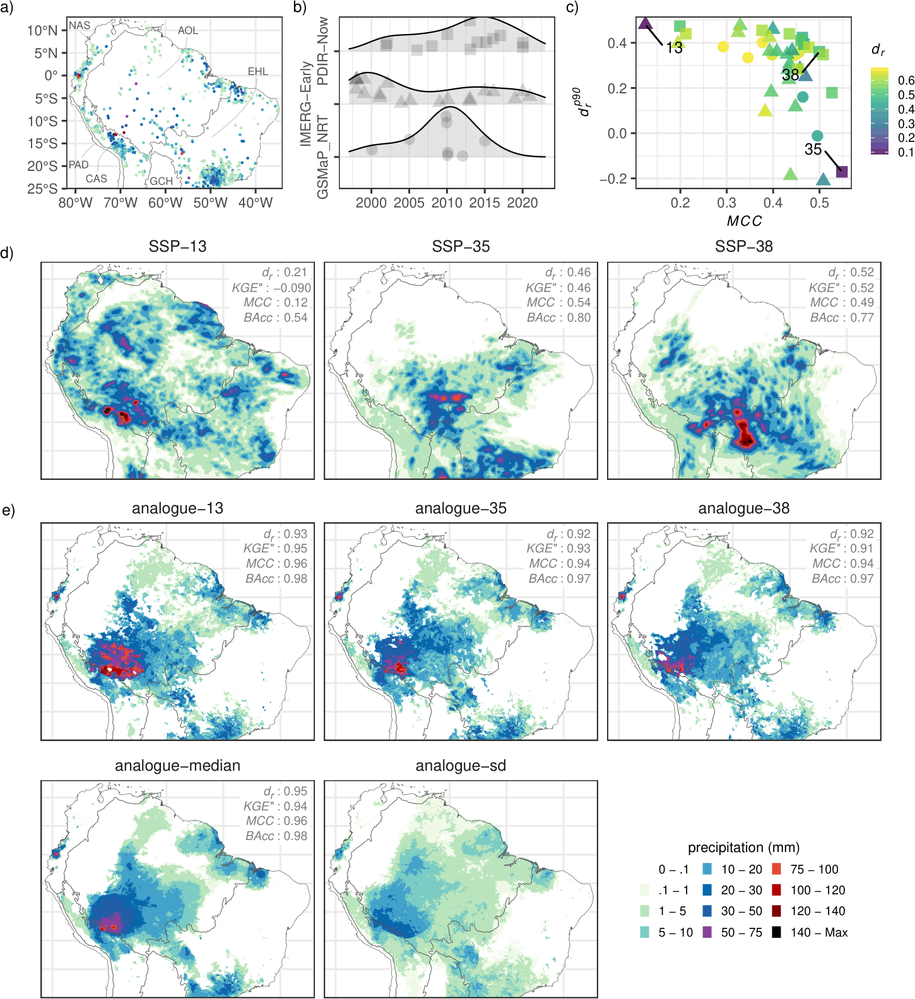

# AC-MSPR

## Code

AC-MSPR is provided as a collection of R scripts. Step-by-step scripts for implementing and applying are provided in the script directory.

*Figure. Illustrative reconstruction using the AC-MSPR framework over Tropical South America. (a) Station-based precipitation from SC-PREC4SA (obs_bc - temporal completeness variant) on 10 January 1960; zero-precipitation values are omitted for clarity. (b) Temporal variability of satellite precipitation-pattern analogues selected using the Pareto-frontier criterion over the period 1998–2021 for each product (PDIR-now, IMERG-Early, and GSMaP_NRT). (c) Performance metrics of the analogue patterns shown in (b). Analogue selection is based on the refined index of agreement for all values ($d_{r}$) and extremes (90th percentile; $d_{r}^{p90}$), and the Matthews correlation coefficient ($MCC$) for precipitation occurrence (wet/dry). Selected analogues are identified and numbered to highlight their multi-criteria performance. (d) Satellite precpitation products (SPP) corresponding to the selected numbered analogue cases. (e) Reconstructed precipitation fields at 0.1$^{\circ}$ from the spatial data fusion model corresponding to the selected and numbered analogue cases in (c and d). Each reconstruction combines satellite analogue patterns (d) and analogue-derived cloud-based features with observed precipitation. The ensemble median and standard deviation across analogue members are additionally shown, highlighting reconstruction uncertainty. In addition, metrics comparing gridded satellite estimates against station observations are provided, including the modified Kling–Gupta efficiency ($KGE''$) and balanced accuracy ($BAcc$). In panels (a) and (d), ecoregions are displayed: Northern Andes (NAS), Peruvian–Atacaman Deserts (PAD), Central Andes (CAS), Amazonian–Orinocan Lowlands (AOL), Eastern Highlands (EHL), and Gran Chaco (GCH).*

## Data

Collection data: <https://doi.org/10.6084/m9.figshare.c.8455069>

## References

Huerta, A., Serrano-Notivoli, R., & Brönnimann, S. (2026). An analogue-conditioned multi-satellite framework for daily precipitation reconstruction, ...

## Acknowledgements

This research has been possible by the support from Swiss Government Excellence Scholarships for Foreign Scholars (ESKAS-Nr: 2023.0404).
